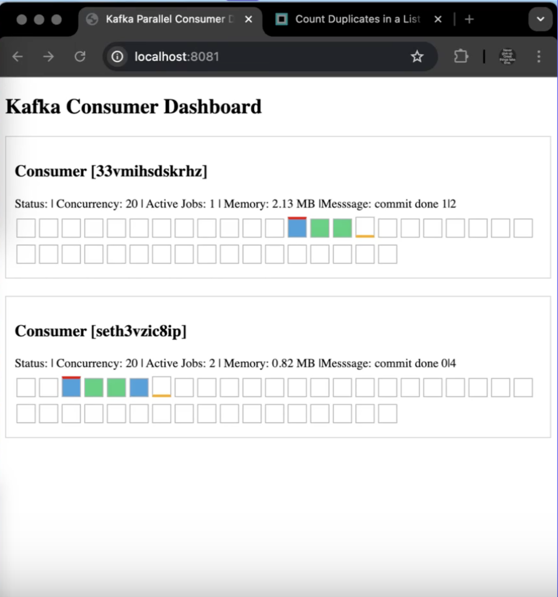

# Kafka Consumer Demo

This document demonstrates the test setup and visual dashboard of the **Parallel Kafka Consumer**.

----------

## 🖥️ Live Dashboard Screenshot



> ⚠️ The dashboard is for **demo and visualization purposes only**. It is not required for production use. Its goal is to help visualize parallel processing, message commit status, and rebalance behavior.

----------

## 🔍 Dashboard Breakdown

Each consumer box (e.g., `Consumer [33vmihsdskrhz]`) shows:

-   **Status:** Whether the consumer is active.
    
-   **Concurrency:** Maximum allowed parallelism.
    
-   **Active Jobs:** How many goroutines are currently processing messages.
    
-   **Memory:** Live memory usage (RSS) for that consumer.
    
-   **Message Commit Status:** Shows number of processed messages vs number of commits done.
    
-   **Block Grid (Circular Buffer):** A visual ring buffer that simulates the current state of message slots in a partition. Each square represents a logical slot in the message stream.
    
    -   ⚪ **White**: Empty or unused slot.
        
    -   🔵 **Blue**: Task is currently being processed.
        
    -   🟢 **Green**: Task is completed and ready for commit.
        

This grid helps visualize how concurrent jobs are handled and how commit lag may evolve as work progresses.

> 🧠 The viewer component uses **Server-Sent Events (SSE)**. It receives stats from consumers over HTTP and pushes them live to the browser. It does not persist any state.

----------

## ⚙️ Demo Setup Instructions

### Folder Structure

```bash
/demo
├── consumer
│   └── main.go       # Runs the custom Kafka consumer
├── producer
│   └── main.go       # Produces test messages to Kafka
└── viewer
    ├── main.go       # HTTP server for dashboard
    └── static
        └── index.html # HTML + JS dashboard

```

### 1️⃣ Start Kafka (e.g., with Docker)

Make sure Kafka and Zookeeper are up and running locally or on a remote broker.

### 2️⃣ Run the Producer

```bash
go run demo/producer/main.go

```

> This produces N test messages to the Kafka topic with a fixed interval between them. It is purely for **load simulation** and used only in this **demo setup**. Not intended for production use.

### 3️⃣ Start One or More Consumers

```bash
go run demo/consumer/main.go

```

> Each consumer initializes an instance of the custom Kafka consumer and begins processing messages in parallel.

-   You can check `consumer.go` to see how the consumer is initialized and configured.
    
-   `Listen()` is the entry point that blocks and starts processing.
    
-   It is used to **subscribe and listen to a specific Kafka topic**, dispatching messages to worker goroutines with concurrency control.
    
-   The rebalance callback ensures cleanup and commit of in-flight messages before partitions are reassigned.
    

### 4️⃣ Launch the Viewer (Optional)

```bash
go run demo/viewer/main.go

```

> The viewer is strictly for **demo purposes only**. It listens for SSE (Server-Sent Events) from consumers and visualizes activity in real time. Not designed for production deployments.

Then visit `http://localhost:8081` to see the live dashboard.

----------

## 🔄 Test Scenarios

-   **Rebalance:** Start/stop consumers and observe how partitions are rebalanced.
    
-   **Crash Handling:** Kill a consumer midway and verify that uncommitted messages are reprocessed.
    
-   **Graceful Shutdown:** Terminate a consumer with `Ctrl+C` to ensure active jobs finish and commits happen.
    

----------

## ▶️ Demo Videos

Watch the key feature demonstrations on YouTube:

-   🔄 [Rebalance Demo](https://youtu.be/qAc_PclKNv8)
    
-   🧹 [Graceful Shutdown & Commit Order](https://youtu.be/wX18o9ZZlWU)
    
-   💥 [Consumer Crash & Reprocessing](https://youtu.be/5TIeONRPiB4)
    

----------

## 📌 Notes

-   Viewer is optional and intended for development/testing insight only.
    
-   For best visualization, keep one terminal open for each component (producer, consumer(s), and viewer).
    
-   The viewer uses in-memory stats to simulate real-time metrics.
    
-   For tuning rebalance, adjust Kafka configs like `max.poll.interval.ms` and `session.timeout.ms`.
    

----------

For full project features, see the `README.md`.